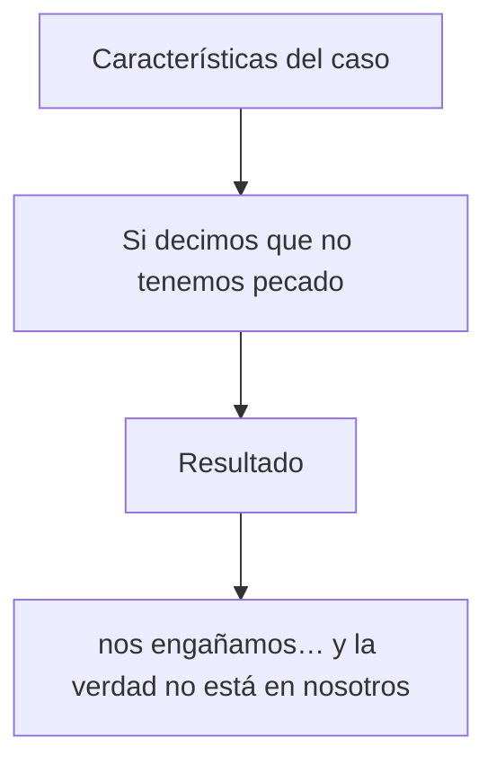

# CGV PDF Builder

Plain Markdown → PDF exporter for CGV study manuals in the locked outline format
(`####` / `-` / `+` / `*` / `>`). Letter-sized pages, cover + interior title, índice,
page numbers, and student/teacher fill-in variants.

The presentation and PDF exporters share the Manager's canonical `manual.md`
gate surface. PDF export preserves every section and footnote. Lines beginning
with `=` are rendered as LBF Scripture blocks without printing the syntax marker;
all appendices, including Appendix D, remain in the manual. The shared source
file is never rewritten.

Typography uses **Iowan Old Style** when available (Georgia / DejaVu fallback), with a
clear indent ladder for outline depth and open leading for readable interior pages.
The default body size is 12.5 pt and remains adjustable with `--body-size` or the
local control panel.

## Outline hierarchy

`cgv_structure.py` owns the hierarchy. The exporter never infers depth from a
Markdown list parser, because mixed `+` / `-` markers are read as separate or
nested lists by general Markdown libraries.

When a curriculum supplies `architecture/<book>-outline.md`, that file is the
authority for matching structural-item depths. The manual remains the content
source; its presentation-oriented indentation is overlaid by the outline depth.
Use `--outline path/to/outline.md` when the outline cannot be auto-discovered.

**Depth comes only from the spaces before the marker.**

| leading spaces | depth |
|---|---|
| 0 | 0 |
| 2 | 1 |
| 4 | 2 |
| 6 | 3 |

The marker never changes depth. These are three siblings at depth 0:

```markdown
+ item
- item
+ item
```

and `new root` lands on exactly the same x as `parent`:

```markdown
+ parent
  - child
    + grandchild
+ new root
```

`*` grammar notes and `>` writer commentary are **annotations**, not structure.
They attach to the nearest preceding item with strictly smaller indentation
(the manual's `owner indent + 2` convention) and render at a small fixed offset
from that item, so a comment can never be mistaken for a nested level and can
never push the tree to the right. An annotation before any item in its section
belongs to the section root. Each item travels with its own annotations across
a page break.

Indentation is validated: it must be a **multiple of two spaces**, and **tabs
are rejected** — a tab has no defined width in the source, so expanding one
would invent a depth. A malformed line stops the export with the file name, the
line number and the indentation found. `--indent-policy warn` downgrades this to
a warning and skips the offending line rather than rounding it into a depth.

The one layout formula is `item_x = base_x + depth × indent_step`, configurable
with `--indent-base`, `--indent-step` and `--annotation-offset` (all in inches;
defaults 0.20 / 0.30 / 0.14). Depth is clamped so a deep item always keeps a
readable measure before the right margin.

Headings stay on their own ladder, independent of item depth: `#` major
division, `##` passage section, `###` observational unit, `####` clause. `###`
and `####` differ in weight, size and left position, and a depth-0 item always
starts at the configured structural base for its section, never from the current
heading level.

## Tests

```bash
python3 -m unittest discover -s tests -t .
```

`tests/test_structure.py` covers the parser (mixed markers, nesting, returns to
root, sibling branches, blank lines, wrapping, odd indentation, tabs, page
breaks, and the Revelation 1:1 regression fixture). `tests/test_layout_pdf.py`
exports a small manual and asserts real PDF text coordinates: equal depths share
one x, marker type never moves an item, wrapped lines hang under the item text,
and indentation survives a page break.

## Install

```bash
python3 -m pip install -r requirements.txt
```

## Export

Terminal-style local app:

```bash
python3 app.py
```

Then open `http://127.0.0.1:8765`.

Command-line export:

```bash
python3 md_to_pdf.py
```

By default, the exporter reads `manual.md` and writes two PDFs beside the source Markdown:

- `alumno.pdf`
- `maestro.pdf`

If there is no local `manual.md`, it reads
`/Users/johnwry/Nextcloud/Documents/GitHub/curriculo/25.1Pedro/slides/1-pedro-manual.md`.

Useful options:

- `--body-size 12.5`: make the manual text larger or smaller.
- `--no-cover`: start directly with the Markdown content.
- `--indent-step 0.30`, `--indent-base 0.20`, `--annotation-offset 0.14`: tune the indent ladder, in inches.
- `--indent-policy warn`: report malformed indentation instead of stopping the export.
- `--logo assets/cgv-logo.png`: place a logo on the cover. If `assets/cgv-logo.png` exists, it is used by default.
- `--cover images/portada.png`: use a full-page cover image, with no margin.
- `--label-color "#111111"`: set the cover manual label color.
- `--label-location lower-quarter`: set the cover manual label position. Options: `top-center`, `center`, `lower-quarter`, `bottom-center`.
- `--logo-location bottom-right`: set the logo badge position. Options: `bottom-right`, `bottom-left`, `top-right`, `top-left`.
- `--logo-background 70%`: set the white logo badge opacity. You can also use `0.7`.
- the interior title page uses the YAML `book`, `title`, `subtitle`, `telos`, and `version`, plus the exported manual type.
- `--single student` or `--single teacher`: export only `Manual del Alumno` or `Manual del Maestro`.
- `--footer-left`, `--footer-center`, `--footer-right`: set footer text.
- `---` on its own line in the Markdown inserts a page break.

Front matter can also set cover metadata:

```yaml
---
book: "1 Pedro"
title: Extranjeros con herencia
subtitle: Una carta a creyentes dispersos que sufren por hacer el bien
telos: "«Les he escrito…» (5:12)."
version: 0.10
logo: assets/cgv-logo.png
cover: images/portada.png
label_color: "#111111"
label_location: lower-quarter
logo_location: bottom-right
logo_background: 70%
---
```

## Markdown Supported

Locked outline roles (see `manual-markdown-format-spec.md`):

| Marker | Role | PDF treatment |
|---|---|---|
| `#` | Major movement | Centered, strong |
| `##` | Development navigation | Centered, smaller / muted (“top and small”) |
| `###` | Section context title | Left-aligned; `### En síntesis` gets a distinct tint |
| `####` | Independent clause (Scripture) | Bold italic — outline root |
| `-` | Dependent clause (Scripture) | Italic; depth = leading spaces ÷ 2 |
| `+` | Phrase (Scripture) | Italic; depth = leading spaces ÷ 2 |
| `*` | Mechanical insert | Smaller, muted roman; hangs off its item, adds no depth |
| `>` | Writer commentary | Roman body; hangs off its item, adds no depth |
| `[^id]` / `[^id]:` | Footnote cite / definition | Superscript cite; appendix definition lines |

Other:

- paragraphs and intro prose (`**lead-ins**`, inline italics)
- numbered lists
- only H1 headings are included in the table of contents
- `<u>word</u>` marks fill-in answers. In `Manual del Alumno`, the word is removed and replaced with an underlined blank twice as wide. In `Manual del Maestro`, the word is rendered bold and underlined.
- unmarked lines inherit the indentation of the item immediately above them
- inline `**bold**`, `*italic*`, and `` `code` ``
- Scripture stays italic-only — not wrapped in «…»
- actor triples (`*A* → *B* → *C*`) render with a distinct weight/color
- Mermaid `flowchart TD` / `graph TD` chains render as local boxed diagrams with drawn arrows:


- blank lines are slide breaks in the source; the PDF keeps only modest spacing
