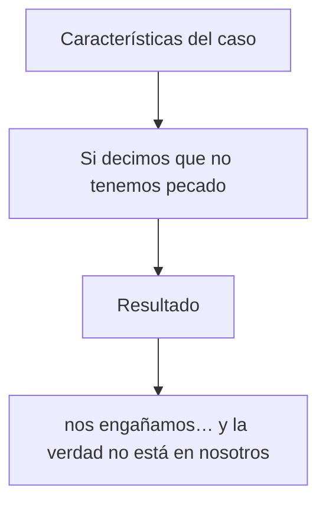

# CGV PDF Builder

Plain Markdown → PDF exporter for CGV study manuals in the locked outline format
(`####` / `-` / `+` / `*` / `>`). Letter-sized pages, cover + interior title, índice,
page numbers, and student/teacher fill-in variants.

Typography uses **Iowan Old Style** when available (Georgia / DejaVu fallback), with a
clear indent ladder for outline depth and open leading for readable interior pages.

## Install

```bash
python3 -m pip install -r requirements.txt
```

## Export

Terminal-style local app:

```bash
python3 app.py
```

Then open `http://127.0.0.1:8765`.

Command-line export:

```bash
python3 md_to_pdf.py
```

By default, the exporter reads `manual.md` and writes two PDFs beside the source Markdown:

- `alumno.pdf`
- `maestro.pdf`

If there is no local `manual.md`, it reads
`/Users/johnwry/Nextcloud/Documents/GitHub/curriculo/25.1Pedro/slides/1-pedro-manual.md`.

Useful options:

- `--body-size 13`: make the manual text larger or smaller.
- `--no-cover`: start directly with the Markdown content.
- `--logo assets/cgv-logo.png`: place a logo on the cover. If `assets/cgv-logo.png` exists, it is used by default.
- `--cover images/portada.png`: use a full-page cover image, with no margin.
- `--label-color "#111111"`: set the cover manual label color.
- `--label-location lower-quarter`: set the cover manual label position. Options: `top-center`, `center`, `lower-quarter`, `bottom-center`.
- `--logo-location bottom-right`: set the logo badge position. Options: `bottom-right`, `bottom-left`, `top-right`, `top-left`.
- `--logo-background 70%`: set the white logo badge opacity. You can also use `0.7`.
- the interior title page uses the YAML `title`, `subtitle`, `telos`, and `version`, plus the exported manual type.
- `--single student` or `--single teacher`: export only `Manual del Alumno` or `Manual del Maestro`.
- `--footer-left`, `--footer-center`, `--footer-right`: set footer text.
- `---` on its own line in the Markdown inserts a page break.

Front matter can also set cover metadata:

```yaml
---
book: "1 Pedro"
title: Extranjeros con herencia
subtitle: Una carta a creyentes dispersos que sufren por hacer el bien
telos: "«Les he escrito…» (5:12)."
version: 0.10
logo: assets/cgv-logo.png
cover: images/portada.png
label_color: "#111111"
label_location: lower-quarter
logo_location: bottom-right
logo_background: 70%
---
```

## Markdown Supported

Locked outline roles (see `manual-markdown-format-spec.md`):

| Marker | Role | PDF treatment |
|---|---|---|
| `#` | Major movement | Centered, strong |
| `##` | Development navigation | Centered, smaller / muted (“top and small”) |
| `###` | Section context title | Left-aligned; `### En síntesis` gets a distinct tint |
| `####` | Independent clause (Scripture) | Bold italic — outline root |
| `-` | Dependent clause (Scripture) | Italic; indent = dependency depth |
| `+` | Phrase (Scripture) | Italic; indent = dependency depth |
| `*` | Mechanical insert | Smaller, muted roman (actors, grammar, triples) |
| `>` | Writer commentary | Roman body; indented with its outline line |
| `[^id]` / `[^id]:` | Footnote cite / definition | Superscript cite; appendix definition lines |

Other:

- paragraphs and intro prose (`**lead-ins**`, inline italics)
- numbered lists
- only H1 headings are included in the table of contents
- `<u>word</u>` marks fill-in answers. In `Manual del Alumno`, the word is removed and replaced with an underlined blank twice as wide. In `Manual del Maestro`, the word is rendered bold and underlined.
- unmarked lines inherit the indentation of the item immediately above them
- inline `**bold**`, `*italic*`, and `` `code` ``
- Scripture stays italic-only — not wrapped in «…»
- actor triples (`*A* → *B* → *C*`) render with a distinct weight/color
- Mermaid `flowchart TD` / `graph TD` chains render as local boxed diagrams with drawn arrows:


- blank lines are slide breaks in the source; the PDF keeps only modest spacing
